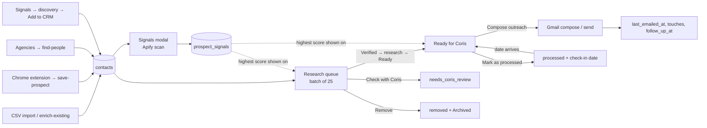

# Prospect Signals V1 — Technical Audit (read-only)

**Repository:** `corisleachman/prospects` @ `b7827fd` (main, 21 Sep 2026) · **Supabase project:** `paprxejgeepvtbqmfgvt` · **Audit date:** 22 Sep 2026
**Scope:** read-only. Nothing was edited, committed, migrated, installed or deployed. Supabase was inspected with metadata tools and read-only `SELECT`s against catalog views and aggregate counts only. No secret values were read out or reproduced here.

---

## 0. Headline findings

1. **The repository is only half the system.** It contains three static HTML files and nothing else: no `supabase/` folder, no migrations, no edge-function source, no README or agent instructions, no workflow files. The schema (14 recorded migrations) and all six edge functions exist only in the live Supabase project. For V1 the repo cannot be the source of truth until the backend is brought into it. This is the first thing Work Package 1 must fix.
2. **Access control is single-user and hard-coded.** `contacts`, `email_templates` and `enquiries` are protected by an RLS policy that matches one email address in the JWT. The newer signal tables use `user_id = auth.uid()`. There is **one** auth user. A junior researcher cannot currently log in under their own account and see any prospects. Workspaces are genuinely missing, not partially present.
3. **The researcher workflow is real, merged and in use**, but lightly: 11 contacts have moved off `unverified`, all by one verifier identity. Its columns, states, batch logic and Ready for Coris flow all live on `contacts` and must be preserved exactly.
4. **The current Apify scan is synchronous, regex-classified and scored on a different model from the spec** (trigger 0–3 + need 0–3 + readiness 0–2 + fit 0–2, versus the spec's five 0–2 factors). It conflates evidence, match, signal and recommendation into one `prospect_signals` row. It can be routed through a new evidence pipeline without being replaced.
5. **There is no companies table.** "Agencies" are derived in the browser by normalising `contacts.company`. Only 96 of 1,291 contacts have `company_domain`, but 895 have `website`. The spec's "High" identity rule depends on a domain, so domain backfill from `website` is a precondition for useful matching.
6. **One unmerged branch has live database changes.** `codex/signal-to-conversation-playbook-20260910` is not merged, but its migration (`extend_signal_copy_decision_guidance`) is applied. Main's playbook doesn't use those columns yet. Protect it.
7. **Security items need attention before client readiness:** a shared secret is hard-coded in the `save-prospect` function source and gates service-role writes; four functions run with `verify_jwt: false` (three verified to do their own owner check); two `SECURITY DEFINER` functions are callable by `anon`; leaked-password protection is off.

---

## 1. Current system map

### 1.1 Frontend

| Item | Evidence | Notes |
|---|---|---|
| Hosting | GitHub Pages from `main`, `.nojekyll` at root | No build step, no `package.json`, no bundler. Deployment is GitHub's default Pages build on push (commits `d526452`, `132ce31` restart it). No `.github/workflows` in repo. |
| Main app | `index.html` — 3,772 lines, ~290 KB, vanilla JS + inline CSS | Single-file monolith. All state in globals (`ALL`, `activeTab`, `AUTH`, etc.). |
| Playbook | `playbook/index.html` (335 lines) | Signal methodology, editable signal copy library backed by `signal_copy_templates` (`playbook/index.html:253-270`). Redirects to `../` if no token (`:331`). |
| Public guide | `build-your-own-crm/index.html` (421 lines) | Marketing page. Enquiry form posts to `enquiries` with the anon key and to web3forms. Not part of the product. |
| Config | `index.html:1074-1082` | `SUPABASE_URL`, anon key (public by design), Google OAuth client ID, sender signature. `GATE_PASSWORD` is dead config — no longer referenced. |

### 1.2 Authentication

- Supabase email/password via raw REST calls, not supabase-js (`index.html:1086-1136`). Tokens live in `localStorage` (`sb_at`, `sb_rt`, `sb_exp`, `sb_em`). Refresh on a 45-minute timer and before expiry.
- `sb()` helper (`index.html:1142`) wraps PostgREST, refreshes on 401 and retries once. If there is no token it falls back to the anon key as the bearer, so RLS is the only barrier.
- Google Identity Services token client for Gmail send/read (`index.html:1148-1185`). Gmail calls are made directly from the browser.
- **One auth user exists.** `verified_by` has one distinct value.

### 1.3 Supabase schema (live, `public`)

| Table | Rows | RLS policy | Notes |
|---|---|---|---|
| `contacts` | 1,291 | `owner all contacts`: `auth.jwt()->>'email' = <Coris's email>` | 61 columns. No `user_id`, no `workspace_id`, no `company_id`. Holds prospect, company, enrichment, research, researcher and outreach state. |
| `email_templates` | 5 | Same email policy | |
| `enquiries` | 2 | anon INSERT `true`; owner SELECT by email | Fed by the public guide. Trigger `notify_enquiry_trg` → `notify_enquiry_fn()` via `pg_net`. |
| `prospect_signal_runs` | 5 (all `succeeded`) | `user_id = auth.uid()` | `contact_count` ≤ 30, `requested_posts_per_contact` 1–5 check constraints. |
| `prospect_signals` | 63 (62 new, 1 saved) | `user_id = auth.uid()` | Unique `(user_id, source_url)`. `total_score` is a generated column. 13 score ≥ 7. |
| `prospect_discoveries` | 15 | `user_id = auth.uid()` | Unique `(user_id, linkedin_url, source_url)`. Different 5-factor score. |
| `signal_copy_templates` | 0 | `user_id = auth.uid()` | Unique `(user_id, signal_key)`. |

**Extensions:** `pg_net`, `pgcrypto`, `uuid-ossp`, `supabase_vault`, `pg_stat_statements`. **`pg_cron` is not installed.**

**Recorded migrations (14):** `add_research_and_touches_columns`, `harden_contacts_remove_anon_access`, `add_warmth_to_contacts`, `add_company_size_and_ownership_to_contacts`, `add_prospect_signal_pipeline`, `index_prospect_signals_run_id`, `track_signal_scans_discoveries_and_copy`, `index_signal_scan_foreign_keys`, `expand_prospect_discovery_results`, `extend_signal_copy_decision_guidance`, `add_contact_enrichment_fields`, `research_verification_workflow`, `coris_processed_workflow`, `research_batches`.

**Schema drift:** the base `contacts`, `email_templates` and `enquiries` tables pre-date the migration history, and `contacts.email_candidates` (added around commit `edb7d93`, 20 Sep) has no recorded migration. A schema-only baseline has to be captured before any new migration is written.

### 1.4 Edge functions (source only in Supabase)

| Function | `verify_jwt` | Auth inside function | Used by | External calls |
|---|---|---|---|---|
| `prospect-signal-scan` | true | `auth.getUser(token)`; queries run as the user (RLS applies) | Signals modal | Apify `harvestapi~linkedin-profile-posts`, `harvestapi~linkedin-post-search` |
| `find-people` | false | Fetches `/auth/v1/user`, requires owner email | Agencies → Find people | Apify `harvestapi~linkedin-profile-search`; service role for contact reads/inserts |
| `enrich-company` | false | Same owner-email check | Agencies → Find with AI | Anthropic Messages + web search (default `claude-haiku-4-5`), OpenAI Responses fallback |
| `save-prospect` | false | Shared secret in `x-extension-secret`, **value hard-coded in source**; CORS `*` | LinkedIn Chrome extension (not in this repo) | Service role on `contacts` (match / update / insert) |
| `suggest-reply` | false | **Not inspected** | Conversation pane, AI draft in compose | Presumed LLM — cannot be verified |
| `notify-enquiry` | false | **Not inspected** | `enquiries` trigger | Presumed email notification |

### 1.5 External services

Apify (three HarvestAPI actors), Anthropic and/or OpenAI (keys in function env), Gmail API (browser OAuth), web3forms, Google Fonts, the LinkedIn Chrome extension (separate codebase, writes through `save-prospect`), and Claude.ai via a copied "Research in Claude" prompt that tells the Supabase connector to write `research_summary` back (`index.html:1979`).

---

## 2. Current prospect workflow

1. **Entry.** Contacts arrive by CSV import with column mapping, dedupe and an "enrich existing" mode (`openImport`, `index.html:2119`), the Chrome extension (`source='LinkedIn'`, surfaced by "Recently added"), Agencies → Find people, or Signals → New prospects → Add to CRM (`index.html:3604`).
2. **Organisation.** Lists are `contacts.category` (10 distinct values). Status, warmth (hot/warm/nurture/cold), archive, bounced/replied flags. Saved views are **browser-only** (`localStorage 'prospect_views'`, `index.html:3675`).
3. **Research, two separate mechanisms.** (a) The owner's "Research in Claude" prompt, which writes `research_summary` and `research_at`. (b) The junior-researcher Research queue (section 4).
4. **Signals.** A header button (`index.html:643`) opens a modal (`index.html:749`) with three tabs: Find signals, Review queue, New prospects.
5. **Message preparation.** Signal cards with score ≥ 7 get "Prepare outreach", which **copies an LLM prompt to the clipboard**. It does not generate a message (`index.html:3561`). Email templates with `{{first_name}}`/`{{company}}` tokens, AI draft via `suggest-reply`, and the playbook's editable signal copy library.
6. **Review and outreach.** Ready for Coris cards (`renderCoris`, `index.html:3394`) → Open LinkedIn / Compose outreach (Gmail) → Mark as processed with a note, actioned date and check-in date. Email send logs `last_emailed_at`, touches and follow-up. There is **no LinkedIn outreach logging** and no sent/replied record per signal.

---

## 3. Existing signal functionality

### 3.1 Known-prospect LinkedIn scan (`action: estimate` → `run`)

| Aspect | Current behaviour | Evidence |
|---|---|---|
| Trigger | Manual only, from the Signals modal. Default selection is the first 10 eligible prospects in the **current view**. Max 30. | `index.html:3467-3538`; function body |
| Eligibility | Has a LinkedIn `/in/` URL and `signal_scanned_at IS NULL`, unless "deliberate rescan" is ticked | `signalEligible()`; function `valid` filter |
| Cost control | Two-step: estimate → `window.confirm` → run with Apify `maxTotalChargeUsd` cap. Actual cost isn't recorded. | `runSignalScan()` |
| Execution | `run-sync-get-dataset-items`, **synchronous**, 120 s timeout, inside the edge function request | function |
| Matching | Post author slug = contact's LinkedIn slug. Posts by anyone else are dropped. | `contactBySlug` |
| Classification | **Regex, first match wins**, across 10 categories. No LLM. | `categories[]`, `classify()` |
| Scoring | trigger (recency: ≤30d = 3, ≤90d = 2, else 1) + category-fixed need + readiness + keyword fit. Threshold 7 matches the spec and playbook. | `classify()` |
| Storage | Upsert into `prospect_signals` on `(user_id, source_url)` with `raw_payload`. `review_status` survives a rescan; classification is overwritten. | function |
| Scan memory | Sets `contacts.signal_scanned_at` and `signal_scan_run_id` for **every valid contact**, whether or not posts came back. Permanent until manual rescan. 38 contacts scanned. | function |
| Review | Modal list, 100 newest non-dismissed, sorted by score. Save / Dismiss (no reason) / View post / Prepare outreach. | `loadSignalResults()` |
| Downstream | Research queue prioritises contacts with any auto signal; Research and Ready cards show the contact's highest-scoring signal regardless of age | `ensureSignalMap()`, `loadNextBatch()` |

**Failure handling gaps.** If Apify returns non-2xx, the run is marked `failed`. But any exception after the run row is inserted (JSON parse, upsert or contact update error) goes to the generic `catch`, returns 500 and **leaves the run `running` forever**. Nothing is retried. Partial results from a timed-out sync call are lost. Old posts are stored and can score up to 7 on keywords alone. The same underlying event across several posts creates several rows. The UI text "Verified LinkedIn post" in the outreach brief overstates what's been checked.

### 3.2 Conversation discovery (`estimate_discovery` → `run_discovery`)

Up to 6 LinkedIn post-search queries (defaults at `index.html:3454`) over 24h/week/month, optional comments. People already in `contacts` (by profile URL) are excluded. A separate five-factor score (subject 0–3, recency 0–2, contribution 0–2, audience 0–2, relationship 0–1) with a gate of subject ≥ 2, audience ≥ 1 and total ≥ 5. A template draft with `[placeholders]` is stored in `draft_copy`. Review actions: Copy draft, Add to CRM, Dismiss. This is effectively the spec's "Conversation keyword feed", which the spec **excludes from V1**. Keep it, but don't route it into the V1 queue.

### 3.3 Other signal-adjacent searches

- **Research queue prebuilt searches:** Google person, Google News with a two-month window and signal terms, and a trade-press `site:` search over eight UK trade titles (`index.html:3178-3183`). These open in new tabs; there's no API. The trade-site list is a ready-made seed for `campaign_source_rules`.
- **enrich-company:** LLM + web search, accept-before-save. This already works as a provider fallback (Anthropic → OpenAI), which is a useful precedent for the provider-neutral adapter.
- **find-people:** LinkedIn people search by company, function and seniority. It's a contact-sourcing tool, not a signal source.

---

## 4. Researcher workflow (must be retained)

**Merged:** PR #7 `research-workflow` (16 Sep), PR #8 `sidebar-redesign`, PR #9 `research-batch` (17 Sep). Authored by "Research Workflow Bot". Migrations `research_verification_workflow`, `coris_processed_workflow`, `research_batches`.

**States** (`contacts.verification_status`, check constraint): `unverified` (1,280) · `verified` (1) · `research_complete` (2) · `ready_for_coris` (4) · `needs_coris_review` (0) · `processed` (0) · `removed` (4).

**Fields on `contacts`:** `verified_at`, `verified_by` (email text), `verification_notes` (unused in UI), `linkedin_research_notes`, `interesting_post_url`, `interesting_post_summary`, `human_signal_strength` (strong/maybe/nothing), `news_research_notes`, `research_source_url`, `mutual_connection_notes`, `research_completed_at`, `research_batch_at`, `research_skipped_at`, `coris_action_note`, `coris_actioned_at`, `coris_check_in_at`.

**Behaviour to preserve:**
- Batch of 25 persisted by a shared `research_batch_at` timestamp. Unfinished contacts carry forward, and automated-signal contacts are prioritised (`loadNextBatch`, `index.html:3211`).
- Two-stage card: a five-item identity checklist (checkboxes are **not persisted**) → Verified / Check with Coris / Remove. Then 2–3 minutes of research with notes, best post, a Strong/Maybe/Nothing rating and a source URL → Ready for Coris / Done — not now (`index.html:3296`).
- Undo toasts on every state change. Remove also sets `status='Archived'`.
- Ready for Coris segments Ready / Due for check-in / Processed, with send-back and reopen.

**Permissions:** none beyond the single-owner RLS. There's no role concept, no assignment and no researcher account. Either the researcher uses the owner's login (which would need confirming, and would be a security and audit problem) or the workflow hasn't been used by a second person yet. **This cannot be verified from the repository.**

**Data-integrity risk:** `rqPatch` (`index.html:3228`) updates local state optimistically and sends the PATCH with `.catch(()=>{})` and **no `res.ok` check**. A failed write (expired session, RLS denial) is silent. Every researcher field goes through this path. That matters more once a second user with narrower permissions exists.

**Spec state mapping:**

| Spec state | Current | Gap |
|---|---|---|
| Unverified | `unverified` | ✓ |
| Verified | `verified` (set on identity pass) | ✓ |
| Researching | none; `verified` doubles as "researching" | Missing as a distinct state |
| Research complete | `research_complete` ("Done — not now") | ✓, slightly different meaning |
| Ready for Coris | `ready_for_coris` | ✓ |
| Needs review | `needs_coris_review` | ✓ (name differs) |
| Remove | `removed` + `Archived` | ✓ |
| — | `processed` | Extra. It's an owner outcome, which V1 should move to `outreach_events` / `review_actions` while keeping the value readable. |

---

## 5. Specification gap assessment

Key: **E** already exists · **P** partially exists · **M** missing · **C** conflicts with current implementation · **U** cannot be verified

| Ref | Requirement | Status | Evidence / note |
|---|---|---|---|
| FR01 | Create/edit/duplicate/pause/archive campaigns | M | No campaign concept anywhere |
| FR02 | Audience from saved lists or prospect fields | P | Lists = `category`; filters exist client-side; saved views are browser-only; ICP fields are sparse (location 96, size 166, revenue 66 of 1,291) |
| FR03 | Several active campaigns per workspace | M | |
| FR04 | Allocate daily target without forcing results | M | |
| FR05 | Watchlist, rotating pool, suppression, discovery | P | `signal_scanned_at` is a one-shot "don't rescan" flag (C with rotation); Archive and `removed` are suppression; `warmth='hot'` is a candidate watchlist; discovery exists but for conversations, not ICP companies |
| FR06 | Web search, monitored pages, publications, LinkedIn, manual | P | LinkedIn ✓ (Apify); manual ✓ as fields on `contacts` (not evidence records); web search/pages/publications M |
| FR07 | Public social | M | |
| FR08 | Source URL, date, excerpt, collection time | P | `source_url`, `observed_at`, `source_text`, `created_at`, `raw_payload` on `prospect_signals`; manual evidence has URL but no date |
| FR09 | Company then contact match with visible confidence | C | Person-only match by LinkedIn slug; no company entity; no confidence field |
| FR10 | Merge duplicate coverage of one event | M | Dedupe is by `source_url` only |
| FR11 | Classify against enabled definitions | P | Hard-coded regex categories, not data-driven |
| FR12 | 10-point score + separate identity confidence | C | Different 4-factor score (3/3/2/2); no identity confidence |
| FR13 | Reject stale/unsupported/generic/ambiguous before drafting | P | Threshold 7 exists; no freshness window gate; stale posts stored |
| FR14 | Editable draft in campaign voice | P | Discovery template placeholders; `suggest-reply` AI draft for email; no voice profile |
| FR15 | Prevent invented context/claims | M | No draft validation |
| FR16 | All decision context on one card | P | Research and Ready cards combine human + auto signal; no match reasoning, history or cooldown |
| FR17 | Copy draft, open LinkedIn | P | Open LinkedIn ✓; copy is of a prompt, not a draft |
| FR18 | Save, dismiss, wrong match, mark sent, mark replied | P | Save/Dismiss ✓; the rest M; "processed" ≈ sent at the contact level |
| FR19 | Dismissal reasons | M | |
| FR20 | Find more signals without repeating work | P | Scan-once marker prevents repeats but also blocks rotation |
| FR21 | Run progress, failures, rejected counts, cost | P | `prospect_signal_runs` has status and estimate; no per-task, rejected or actual-cost data; stuck-`running` risk |
| FR22 | Researcher states and manual evidence form | P | States ✓ (section 4); evidence isn't a separate record |
| FR23 | Automated + manual through one pipeline | C | Parallel paths: auto → `prospect_signals`, manual → `contacts` columns; only joined visually |
| FR24 | RLS on every workspace record | C | Email-literal and per-user policies; no workspace |
| FR25 | Credentials and privileged access off the client | P | Provider keys in function env ✓; service-role functions ✓; hard-coded extension secret in function source ✗ |
| FR26 | Approved edits as examples | M | |
| FR27 | Export records | P | Contacts CSV export exists; nothing for signals |
| §9 | Scheduled server-side runs | M | No `pg_cron`; all runs are user-initiated and synchronous |
| §9 | Idempotency keys, immutable evidence | M | Upsert overwrites classification |
| §9 | Every product record carries `workspace_id` | M | |
| §10 | Researchers see only assigned queues | M | |
| §10 | Actor + timestamp on material changes | P | `verified_by` / `*_at` on some fields; no audit log |
| NFR | Board interactive < 3 s | U | Current load pulls all 1,291 contacts with `select=*` in 1,000-row pages, plus all signals unpaginated. Fine now; watch as evidence grows. |
| NFR | Europe/London schedules and dates | P | Dates are formatted in the browser locale; no workspace timezone |
| NFR | Keyboard accessibility | U | Not audited |
| §3 | Signals becomes a full area; Apify stays as quick scan | P | Signals is a modal; the sidebar IA from PR #8 gives it a natural home |
| §13 | No automated LinkedIn sending | E | Nothing sends LinkedIn messages |

---

## 6. Proposed technical architecture

### 6.1 Principles for fitting V1 in

- **Additive and dual-running.** New tables sit alongside the existing ones. The current modal, Research queue and Ready for Coris keep working unchanged until their V1 replacements are accepted.
- **`contacts` stays authoritative** for people, as the spec requires. New tables reference `contacts.id`; nothing is copied.
- **Backend as code first.** Before any V1 migration: capture a schema baseline and pull all six functions into `supabase/` in the repo.
- **One pipeline, many intakes.** Apify, web search, page monitors and researcher submissions all produce `evidence_items`. Everything downstream (match → fingerprint → classify → score → draft) runs the same code regardless of source.

### 6.2 Workspaces and membership

`workspaces` and `workspace_members (workspace_id, user_id, role, status)` with roles `owner | reviewer | researcher | client_admin`. Access helpers live in a non-exposed `private` schema as `SECURITY DEFINER` functions with a fixed `search_path`, for example `private.has_workspace_role(ws uuid, roles text[])`. Every policy calls these helpers rather than repeating joins. One "Coris" workspace is created and every existing row is backfilled into it.

**Insert-path compatibility.** Four existing writers don't know about workspaces: browser import and add, `save-prospect`, `find-people`, and discovery → Add to CRM. A `BEFORE INSERT` trigger fills `workspace_id` when it's null. It uses the caller's default membership when `auth.uid()` exists, and the workspace flagged `is_legacy_default` for service-role callers. That keeps every current path working without touching its code in WP1. The fallback is removed before client activation.

### 6.3 Campaigns and campaign prospects

`campaigns` holds identity, status, objective, audience definition (`audience_filter jsonb` plus an optional `source_list` pointing at a `category` value), discovery allowance (0–3), freshness days (default 14), cooldown days, weight, schedule, timezone, voice profile and cost ceiling. `campaign_prospects` materialises membership per contact with `group` (`watchlist | rotating | suppressed | discovery`), per-source-family `last_scanned_at` (jsonb or a child table), `next_eligible_at`, `suppression_reason` and `assigned_researcher_id`. Membership is refreshed from the filter on demand and before each run, so rotation and "Find more" have a real cursor. `contacts.signal_scanned_at` stays as legacy for the quick scan and is copied into LinkedIn `last_scanned_at` on backfill.

### 6.4 Source and signal rules

- `signal_definitions`: global rows (`workspace_id IS NULL`, read-only to users) plus workspace overrides. Fields: key, label, category, polarity, observable evidence, examples, false-positive examples, default strategy and search terms. Seed from the spec's 12 categories reconciled with the 10 regex categories and the playbook's `SIGNAL_COPY_DEFAULTS` keys (see Risks → taxonomy).
- `campaign_signal_rules`: enabled flag, minimum score, message strategy, CTA rule, and whether private messages require approval.
- `campaign_source_rules`: source family, allowed domains/profiles, excluded domains and per-source interval. Seed the trade-press list from `RQ_TRADE_SITES`.

### 6.5 Search runs and source tasks

`search_runs` (workspace, campaign or null for all, `run_type` scheduled | find_more | quick_scan | manual, `idempotency_key` unique, status, counts by outcome, estimated and actual cost) and `source_tasks` (run, provider, source family, input, provider reference, status, attempts, cost, error). Tasks are the unit of retry, so a failed task never touches completed ones. The existing `prospect_signal_runs` stays for the quick scan. The quick scan should also write a `search_runs` row once it's routed through the pipeline (WP3).

**Execution model.** `pg_cron` (needs enabling) calls a lightweight `signals-orchestrator` function through `pg_net`. The orchestrator creates tasks and starts providers **asynchronously**: Apify's async run endpoint plus a webhook to a `signals-callback` function that validates a per-task secret or signature before accepting data. Search APIs that answer quickly can be called inline per task. Processing (match, dedupe, score, draft) is a separate function invoked per batch of new evidence. Nothing long-running happens inside a DB transaction or a single browser request.

**Provider-neutral adapter.** Put a `_shared/providers/` module in functions with an interface like `search(query, window) → NormalizedResult[]` and `fetchPage(url) → Snapshot`. Apify, the chosen web-search API and the LLM classifier are each one adapter. `enrich-company`'s Anthropic → OpenAI fallback is the pattern to generalise.

### 6.6 Evidence storage

`evidence_items` is immutable after insert (enforced by a trigger that blocks UPDATE of content columns). It holds source family, provider, canonical URL (tracking parameters stripped) and URL hash, title, source name, excerpt (minimum text needed), published date, `published_date_confidence`, collected date, submitted-by, researcher confidence (Strong/Maybe/Nothing) and notes. It's unique on `(workspace_id, canonical_url_hash)` for automated sources. Manual submissions may duplicate a URL; the duplicate is linked, not rejected. `provider_payloads` keeps raw JSON separately with a retention date.

### 6.7 Company and contact matching

Introduce `companies (workspace_id, name, normalized_name, domain, website, linkedin_url, aliases[], city, country, size, …)` and a nullable `contacts.company_id`. Backfill by grouping on the same normalisation the Agencies view uses (`_agNorm`, `index.html:1545`) plus the domain derived from `website`. `entity_matches` records candidate company and contact per evidence item, the method (domain, official social, LinkedIn author slug, name+location, researcher-selected), confidence (high/medium/low), reasons and decision (auto-accepted, human-confirmed, wrong match). **Spec adjustment:** add a person-level High rule, "evidence authored by the contact's own LinkedIn profile", because that's how the current scan matches and it's stronger than a domain match.

### 6.8 Scoring and deduplication

`signals` holds one row per underlying event: workspace, company, chosen contact, campaign, definition key, event date, `fingerprint` (company + event type + normalised named entities + event-date bucket), the five 0–2 factor scores with a generated total, identity confidence, state (`candidate | needs_review | ready | saved | dismissed | sent | replied | rejected`), primary evidence, cooldown flag and reasons. `signal_sources` links the signal to its evidence items. Stale, repost and dismissed-fingerprint checks run before a signal is created. Rejections are counted on `search_runs` and not surfaced.

### 6.9 Message drafts and version history

`voice_profiles` (rules, banned phrases, length, emoji, approved personal-context facts), `voice_examples` (approved messages, tagged by strategy, plus accepted edits), and `message_drafts` (signal, version, kind `generated | alternative | edited | final`, text, strategy, model ID, prompt inputs hash or snapshot, evidence IDs, validation result, parent version). Drafts are only generated for `ready` signals.

### 6.10 Review actions and outreach outcomes

`review_actions` is append-only: actor, action (`copy | open_linkedin | save | dismiss | wrong_match | edit | generate_alt | verify | submit`), reason code for dismissals, and payload. `outreach_events` records sent/replied with channel, final text, date, contact and signal, and drives cooldown. For compatibility, a trigger or explicit write also updates the existing contact fields the dashboard already reads (`coris_actioned_at`, `status`, `replied`) so Ready for Coris and the nudges stay truthful.

### 6.11 Server-side collection and secrets

All provider keys stay in function secrets. The hard-coded `save-prospect` secret moves to an env secret and is rotated, which needs a matching Chrome-extension update. Callbacks never use the service role until the payload is validated. Browser code only calls PostgREST under RLS and user-JWT functions.

### 6.12 RLS and workspace isolation

- Every new table: `workspace_id NOT NULL` (except global `signal_definitions`), RLS enabled, and **explicit `GRANT`s** to `authenticated` (don't rely on default exposure).
- Read access: `has_workspace_role(workspace_id, any role)`. Writes by role: owner for configuration; owner/reviewer for review and outreach; researcher only for evidence submissions and research state on assigned prospects.
- Researcher field-level restriction on `contacts` can't be done with row policies alone. Route researcher updates through an RPC (`submit_research`, `set_research_state`) that validates assignment and allowed columns, and give researchers SELECT on contacts only when a `campaign_prospects` or assignment row exists.
- **Transition for `contacts` and `email_templates`:** add the membership policy **alongside** the existing email policy (permissive policies OR together), verify with a second test workspace, then drop the email-literal policy. This removes lock-out risk mid-migration.
- Fix lints alongside: revoke `EXECUTE` on `notify_enquiry_fn` and `rls_auto_enable` from `anon`/`authenticated`, set `search_path`, and turn on leaked-password protection.

---

## 7. Proposed data changes

### 7.1 Changes to existing tables

| Table | Change | Backfill / migration | RLS |
|---|---|---|---|
| `contacts` | Add `workspace_id` (FK, indexed; NOT NULL after backfill), `company_id` (nullable FK). Keep every existing column. Add `'researching'` to the `verification_status` check (optional, additive). | All 1,291 rows → Coris workspace. `company_id` from companies backfill. Insert trigger fills `workspace_id`. | Membership policy added; email policy removed after verification. Researcher SELECT scoped to assignments; writes via RPC. |
| `email_templates` | Add `workspace_id` | 5 rows → Coris workspace | Membership |
| `prospect_signal_runs` | Add `workspace_id` | 5 rows | `user_id` policy → membership (keep `user_id` as actor) |
| `prospect_signals` | Add `workspace_id`, `evidence_item_id` (nullable, set when mirrored into the pipeline) | 63 rows; mirror into `evidence_items` + `entity_matches` (method = LinkedIn author, high) + `signals` with legacy scores preserved in `legacy_*` columns and re-scored later | Membership. Table becomes legacy read path, then read-only after WP6. |
| `prospect_discoveries` | Add `workspace_id` | 15 rows | Membership. Stays a separate, excluded-from-V1 queue. |
| `signal_copy_templates` | Add `workspace_id`; keep `user_id` | 0 rows | Membership. Content feeds `signal_definitions` strategy seed. |
| `enquiries` | **No change** | — | Public guide inbox; keep owner-only. Out of product scope. |

### 7.2 New tables

| Table | Purpose | Important fields | Relationships | Reuses | Suggested RLS |
|---|---|---|---|---|---|
| `workspaces` | Tenant and defaults | name, slug, timezone (`Europe/London`), daily_target (25), target_min/max, cost_ceiling_daily, is_legacy_default, status | — | — | Members read; owner update; insert service-only |
| `workspace_members` | Membership and role | workspace_id, user_id, role, status, is_default, invited_by | → workspaces, auth.users | — | Members read own workspace list; owner manages |
| `companies` | Matching index for agencies | name, normalized_name, domain, website, linkedin_url, aliases[], city, country, size | ← contacts.company_id | Derived from `contacts.company*`, `website` | Membership; researcher read on assigned |
| `campaigns` | Main configuration unit | name, objective, status, owner_id, audience_filter, source_list, discovery_allowance, freshness_days, cooldown_days, weight, schedule, voice_profile_id, cost_ceiling | → workspaces, voice_profiles | Lists (`category`) as audiences | Members read; owner write |
| `campaign_prospects` | Membership, rotation, assignment | campaign_id, contact_id, group, source_scan_state, next_eligible_at, suppression_reason, assigned_researcher_id | → campaigns, contacts | `signal_scanned_at`, `status='Archived'`, `warmth` | Owner/reviewer all; researcher own assignments |
| `signal_definitions` | Event library | workspace_id NULL = global, key, category, polarity, description, examples, false_positives, default_strategy, search_terms | ← rules, signals | Regex categories; playbook keys | Global: all read, no write; workspace rows: owner write |
| `campaign_signal_rules` | Per-campaign enablement and strategy | campaign_id, definition_key, enabled, min_score, strategy, cta_rule, requires_approval | → campaigns, signal_definitions | `signal_copy_templates` content | Members read; owner write |
| `campaign_source_rules` | Allowed collectors and domains | campaign_id, source_family, provider, include_domains[], exclude_domains[], profiles[], interval_days | → campaigns | `RQ_TRADE_SITES` | Members read; owner write |
| `voice_profiles` | Style and constraints | name, max_chars (280), greeting, emoji_policy, humour, cta_styles, banned_phrases[], personal_context[] | ← campaigns | — | Members read; owner write |
| `voice_examples` | Approved examples and accepted edits | profile_id, text, strategy, source (`seed | approved_edit`), approved_by | → voice_profiles, message_drafts | — | Members read; owner/reviewer write |
| `search_runs` | Run log | campaign_id?, run_type, idempotency_key (unique), status, scope, counts_{new,duplicate,stale,weak,ambiguous}, est_cost, actual_cost, started/completed | → campaigns | `prospect_signal_runs` pattern | Members read; writes service-only |
| `source_tasks` | Retryable unit of collection | run_id, provider, source_family, input, provider_ref, status, attempts, cost, error | → search_runs | — | Members read; service-only write |
| `evidence_items` | Immutable captured evidence | source_family, provider, canonical_url, url_hash, source_name, title, excerpt, published_at, published_date_known, collected_at, task_id?, submitted_by?, researcher_confidence, notes | → source_tasks; ← signal_sources, entity_matches | `prospect_signals` source fields; researcher URL fields | Members read; researcher insert (manual only); no update |
| `provider_payloads` | Raw JSON for audit | evidence_item_id/task_id, payload, expires_at | → evidence_items | `raw_payload` columns | Owner read; service write |
| `entity_matches` | Candidate matches | evidence_item_id, company_id, contact_id, method, confidence, reasons, decision, decided_by | → evidence, companies, contacts | — | Members read; owner/reviewer/researcher decide |
| `signals` | Deduplicated event | campaign_id, company_id, contact_id, definition_key, event_date, fingerprint, 5 factor scores + total, identity_confidence, state, primary_evidence_id, summary, why_person, warnings | → many | `prospect_signals` (mirrored) | Members read; researcher read only on assigned; owner/reviewer update state |
| `signal_sources` | Signal ↔ evidence | signal_id, evidence_item_id, is_primary | → signals, evidence | — | Follows signal |
| `message_drafts` | Versioned drafts | signal_id, version, kind, text, strategy, model, prompt_snapshot, evidence_ids[], validation, parent_id | → signals | — | Owner/reviewer |
| `review_actions` | Append-only action log | signal_id?, contact_id?, actor_id, action, reason_code, payload | → signals, contacts | Researcher state changes | Members insert own; read; no update/delete |
| `outreach_events` | Sent, replied, outcomes | contact_id, signal_id?, channel, message_text, occurred_at, outcome | → contacts, signals | `coris_actioned_at`, `last_emailed_at`, `replied` | Owner/reviewer |

**Backfill implications:** all backfills are additive. Nothing is deleted or renamed. `contacts` gains two nullable columns, then one NOT NULL after backfill, which is a quick operation at 1,291 rows. The one irreversible-feeling step, dropping the email-literal policy, is deferred until isolation tests pass.

---

## 8. Proposed application changes

| Area | Change | Package |
|---|---|---|
| Session bootstrap | After sign-in, load memberships, set `CURRENT_WORKSPACE` and role, show the workspace name. Hide owner-only controls for researchers. | WP1 |
| `sb()` / writes | Surface write failures. Make `rqPatch` check `res.ok` and revert with a toast. | WP1 (low-risk fix) |
| Sidebar | New **Signals** section with Today's signals, Campaigns, Research queue (existing), Signal library, Voice, Runs & coverage. The header Signals button opens Today's signals; the modal remains as "Quick LinkedIn scan". | WP1 placeholder → WP6 |
| Campaign builder | Six-step flow: basics, audience (lists + prospect-field filters + watchlist), signals & sources, voice, operation, test (eligible count, sample queries, example drafts) | WP2 |
| Today's signals | Two-column card board with every section in spec §3; filters; card actions; dismissal-reason picker; cooldown warnings | WP6 |
| Find more signals | Scope picker (one or all campaigns) → estimate → confirm → run → result summary (new / duplicate / stale / weak / ambiguous) | WP6 |
| Researcher submission | "Submit evidence" on the existing research card (URL, date or unknown, summary, category, Strong/Maybe/Nothing, notes) writing `evidence_items` via RPC. Keep current fields and buttons. | WP3 (form) / WP7 (assignments, feedback) |
| Runs & coverage | Run list, per-task status, retry failed tasks, cost by campaign, coverage vs eligible | WP6 |
| Functions | `signals-orchestrator`, `signals-callback`, `signals-process` (match → dedupe → classify → score), `signals-draft`, `research-submit` RPC; refactor `prospect-signal-scan` to emit `evidence_items` | WP3–WP5 |

---

## 9. File-by-file plan for Work Package 1

| File | New / changed | Purpose |
|---|---|---|
| `AGENTS.md` (and/or `CLAUDE.md`) | New | Project rules for every agent: repo is source of truth; migrations only via `supabase/migrations`; never edit live functions without committing source; protect research-queue fields; no secrets in code. Several agents (Codex branches, "Research Workflow Bot", Claude) already commit here. |
| `docs/architecture.md` | New | System map from this audit, kept current |
| `docs/signals-v1/spec.md`, `docs/signals-v1/audit.md` | New | Spec and this audit in-repo |
| `supabase/config.toml` | New | Supabase CLI project config, if the CLI will be used (decision) |
| `supabase/migrations/20260922000000_baseline.sql` | New | Schema-only snapshot of current `public` (tables, constraints, policies, triggers, functions) so drift is captured. Marked as already applied. |
| `supabase/functions/{prospect-signal-scan,find-people,enrich-company,save-prospect,suggest-reply,notify-enquiry}/index.ts` | New (imported verbatim) | Backend under version control. `save-prospect` imported with the secret replaced by `Deno.env.get(...)`. Deploy only after secret rotation is agreed. |
| `supabase/migrations/…_workspaces.sql` | New | `workspaces`, `workspace_members`, `private.has_workspace_role()`, Coris workspace seed, membership for the existing user |
| `supabase/migrations/…_workspace_columns.sql` | New | `workspace_id` on the six product tables, backfill, insert-fill trigger, indexes, NOT NULL |
| `supabase/migrations/…_workspace_rls.sql` | New | Membership policies added alongside existing ones; explicit grants |
| `supabase/migrations/…_campaigns.sql` | New | `campaigns`, `campaign_prospects`, `signal_definitions` (+ global seed), `campaign_signal_rules`, `campaign_source_rules`, `voice_profiles` (empty) |
| `supabase/migrations/…_evidence_foundation.sql` | New | `companies`, `contacts.company_id`, `search_runs`, `source_tasks`, `evidence_items`, `provider_payloads`, `entity_matches`, `signals`, `signal_sources`, `review_actions`, `outreach_events`, `message_drafts` (tables only, no writers yet) |
| `supabase/migrations/…_backfill_companies_and_legacy_signals.sql` | New | Companies from contacts; mirror 63 `prospect_signals` into evidence/match/signal records |
| `supabase/migrations/…_lint_fixes.sql` | New | Revoke EXECUTE on the two definer functions, set `search_path` |
| `supabase/tests/isolation.sql` (or `docs/signals-v1/isolation-test.md`) | New | Repeatable two-workspace isolation checks for AC13 |
| `index.html` | Changed (small) | Workspace bootstrap after `enterApp()`; workspace indicator; `rqPatch` error handling; sidebar Signals group with a read-only Campaigns list. No change to research, Ready for Coris, email or the Signals modal behaviour. |
| `js/workspace.js` (optional) | New | If agreed, new V1 UI code goes in plain script files loaded by `index.html` to keep the monolith from growing. No dependency or build step. |
| `playbook/index.html` | Unchanged in WP1 | Pending decision on the unmerged branch |

---

## 10. Risks and unresolved decisions

### 10.1 Assumptions not supported by repository evidence

- "The repo is the source of truth" is **not currently true** for schema or server code.
- Whether the junior researcher has used the system, and under which login, **can't be verified**. There's one auth user and one verifier identity.
- `suggest-reply` and `notify-enquiry` internals weren't inspected. Their auth model is assumed to be an owner check, like the other `verify_jwt: false` functions, but that isn't verified.
- The Chrome extension's code and its copy of the shared secret are outside this repo.

### 10.2 Missing schema or infrastructure

No baseline migration; drift on `email_candidates`; no `pg_cron`; no async job or callback infrastructure; no companies entity; no audit log; no server-side saved views.

### 10.3 Conflicts with work already underway

- **Unmerged branch `codex/signal-to-conversation-playbook-20260910`**: one commit adding the "From signal to conversation" playbook section. Its DB migration is already applied, so DB and main are out of step. Merge, rebase or retire it deliberately.
- Stale branches whose commits are already on main (verified by patch-id): `sidebar-redesign`, `codex/signal-scan-state-and-copy-20260908`, plus fully merged ones. Safe to delete later; no action in WP1.
- Recent active work (19–21 Sep) is concentrated in Agencies, email candidates and Finder, all of which write `contacts` company fields. The companies backfill must read these rather than replace them, and the Agencies view keeps writing to `contacts` in V1.
- Several agents are committing directly to `main` with differing conventions. WP1 changes to `index.html` will conflict easily without an agreed branch policy.

### 10.4 Security concerns

1. Shared secret hard-coded in `save-prospect` source (service-role writes, CORS `*`). Move to env and rotate.
2. RLS keyed to a literal email: brittle, and it blocks any second user.
3. `notify_enquiry_fn` and `rls_auto_enable` are `SECURITY DEFINER` and executable by `anon` through `/rest/v1/rpc/…`. Mutable `search_path` on the former.
4. Leaked-password protection is off.
5. Silent write failures in `rqPatch`.
6. Browser `localStorage` holds refresh tokens (normal for SPAs, but raises the stakes of any XSS). `escapeHtml` was recently hardened (`6c9d8a4`). Keep all new card rendering escaped, since evidence text is untrusted third-party content.
7. Future callbacks and webhooks must be authenticated before any service-role write.

### 10.5 Provider dependencies

Apify HarvestAPI actors (pricing constants are hard-coded; LinkedIn scraping carries terms-of-service and stability risk); the web-search provider is undecided; LLM provider (Anthropic by default in `enrich-company`, OpenAI fallback); Gmail API for email. Public social collectors are unselected. Deliberately, nothing in WP1 depends on a provider decision.

### 10.6 Where the spec should adjust to technical reality

- **Identity confidence:** add a person-level High rule for evidence authored by the contact's own LinkedIn profile. Domain-based High needs the website → domain backfill, since only 96 contacts have a domain today.
- **Scoring model:** the spec's 5 × 0–2 replaces the live 3/3/2/2 model. Decide whether to migrate (recommended; keep legacy scores for comparison) or adapt the spec.
- **Taxonomy:** live categories include `commercial_momentum`, `ai_enabled_growth` and `founder_perspective`, which aren't in the spec. The spec adds `commercial_targets`, `ownership_change`, `marketing_consistency`, and splits recognition from client movement. `polarity` exists live and is worth keeping as an attribute.
- **Researcher states:** add `researching`, or accept that `verified` means "researching". Treat `processed` as an owner outcome.
- **Volume target:** live yield is 13 candidates at score ≥ 7 from 38 scanned contacts over five runs, with regex scoring whose precision hasn't been measured. Reaching 20–30 genuine daily candidates will depend on non-LinkedIn sources and a realistic rotating pool. ICP fields are sparse (location on 96 contacts, size on 166), so audience filters won't select well until enrichment improves.
- **Discovery:** the spec's "up to three ICP-fit agencies per day" is different from the live conversation discovery. The live feature maps to the excluded "conversation keyword feed" and should stay separate.
- **Scheduling:** "scheduled database jobs" requires enabling `pg_cron`.

---

## 11. Recommended first build package (WP1: workspace, campaign and evidence foundation)

**Goal:** establish tenancy, campaign records and the unified evidence schema, with zero regression in the live dashboard and no change to how signals are collected yet.

### Checklist

1. **Guardrails:** add `AGENTS.md`, `docs/architecture.md`, and the spec and audit to the repo. Agree the branch and PR policy.
2. **Baseline:** capture a schema-only snapshot into `supabase/migrations/…_baseline.sql`, including policies, triggers and functions. Import all six edge functions' source (`save-prospect` secret → env var, not deployed until rotation is scheduled).
3. **Workspaces:** create `workspaces`, `workspace_members` and `private.has_workspace_role()`. Seed the "Coris" workspace (Europe/London, target 25) and an owner membership for the existing user.
4. **Workspace columns:** add `workspace_id` to `contacts`, `email_templates`, `prospect_signal_runs`, `prospect_signals`, `prospect_discoveries` and `signal_copy_templates`. Backfill, add the insert-fill trigger, index, then set NOT NULL.
5. **RLS (dual-running):** add membership policies next to the existing ones and grant explicitly. Don't drop the email-literal policies in this step.
6. **Campaign schema:** `campaigns`, `campaign_prospects`, `signal_definitions` (global seed from the reconciled taxonomy), `campaign_signal_rules`, `campaign_source_rules`, `voice_profiles`. Seed one **draft** campaign, "UK independent agencies — founders", from spec §4 with no schedule.
7. **Evidence schema:** `companies` (+ `contacts.company_id`), `search_runs`, `source_tasks`, `evidence_items` (immutability trigger), `provider_payloads`, `entity_matches`, `signals`, `signal_sources`, `review_actions`, `outreach_events`, `message_drafts`. Tables and policies only.
8. **Backfills:** companies from contacts (normalised name, website → domain); mirror the 63 `prospect_signals` into evidence, match and signal records with legacy scores kept.
9. **Isolation test:** create a second test workspace with a test user and sample rows; run the scripted read/write checks both ways; then drop the email-literal policies from `contacts`, `email_templates` and `enquiries`-read (owner membership replaces them).
10. **Frontend (minimal):** workspace bootstrap and indicator; `rqPatch` failure handling; sidebar Signals group with a read-only Campaigns list. Everything else untouched.
11. **Security quick fixes:** revoke anon/authenticated EXECUTE on the two definer functions, set `search_path`, enable leaked-password protection.
12. **Regression pass** across the flows listed in the acceptance criteria.

### Acceptance criteria

| # | Criterion |
|---|---|
| A1 | All 1,291 contacts (and the other product tables) load in the dashboard for the owner exactly as before, with counts unchanged in every sidebar stage and list. |
| A2 | Import, add/edit contact, Chrome-extension save, Agencies find-people add, discovery Add to CRM, email send and log, Research queue actions (verify, check, remove, ready, done, skip, next batch) and Ready for Coris actions all still persist. Verified by re-reading rows. |
| A3 | Quick LinkedIn scan and discovery search still run and write rows, now with `workspace_id` populated. |
| A4 | A test user in workspace B can't read, insert, update or delete any workspace A row in any product table, through either PostgREST or user-JWT functions, and vice versa. |
| A5 | Every new product table has RLS enabled, explicit grants and `workspace_id NOT NULL` (except global definitions). Security advisors show no new findings and the two definer lints are cleared. |
| A6 | Schema in `supabase/migrations` reproduces the live `public` schema, checked by diffing a fresh dump. |
| A7 | All six edge functions' source is committed. No secret literals remain in the repo. |
| A8 | One draft campaign exists with enabled signal rules and source rules and resolves an eligible-prospect count through `campaign_prospects`. |
| A9 | The 63 legacy signals appear as `evidence_items` + `signals` with source URL and date, linked to the correct contact, without changing `prospect_signals`. |
| A10 | A failed PATCH in the Research queue shows an error and reverts the card state. |
| A11 | No collection, scheduling or message generation behaviour changes. No new external dependency. |

---

## Approval needed

1. **Backend into the repo.** Approve capturing a schema baseline and committing all six edge functions, and decide who deploys (manual, Supabase CLI, or an agent).
2. **RLS transition.** Approve dual policies first, then removal of the email-literal policies after the isolation test passes.
3. **Researcher access.** Confirm whether the researcher has been using your login, and approve creating a separate researcher account (and a throwaway test user for workspace B).
4. **Companies table in WP1.** Include the `companies` entity and backfill now, or defer to WP4.
5. **Legacy signals.** Keep `prospect_signals` as a legacy table mirrored into the new model (recommended) or evolve it in place.
6. **Scoring model.** Adopt the spec's 5 × 0–2 model with legacy scores retained, or adjust the spec.
7. **Signal taxonomy.** Approve reconciling the 12 spec categories with the 10 live ones (keep `ai_enabled_growth` / `founder_perspective`?) and keeping polarity.
8. **Researcher states.** Add a distinct `researching` state, or treat `verified` as researching.
9. **Unmerged playbook branch.** Merge, rebase or retire `codex/signal-to-conversation-playbook-20260910`, whose DB columns are already live.
10. **Secret rotation.** Approve moving the `save-prospect` secret to env and rotating it, with the matching Chrome-extension update.
11. **Frontend structure.** New V1 UI in separate plain-JS files loaded by `index.html`, or keep everything in the monolith.
12. **Scheduling infrastructure (for WP3).** Approve enabling `pg_cron` and moving Apify runs to async with authenticated callbacks.
